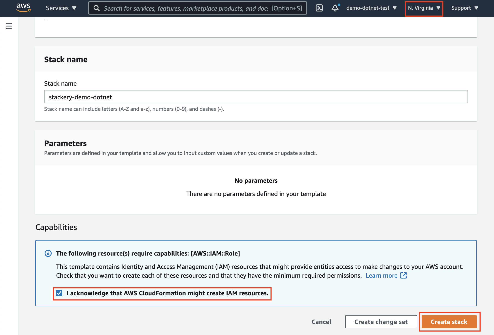
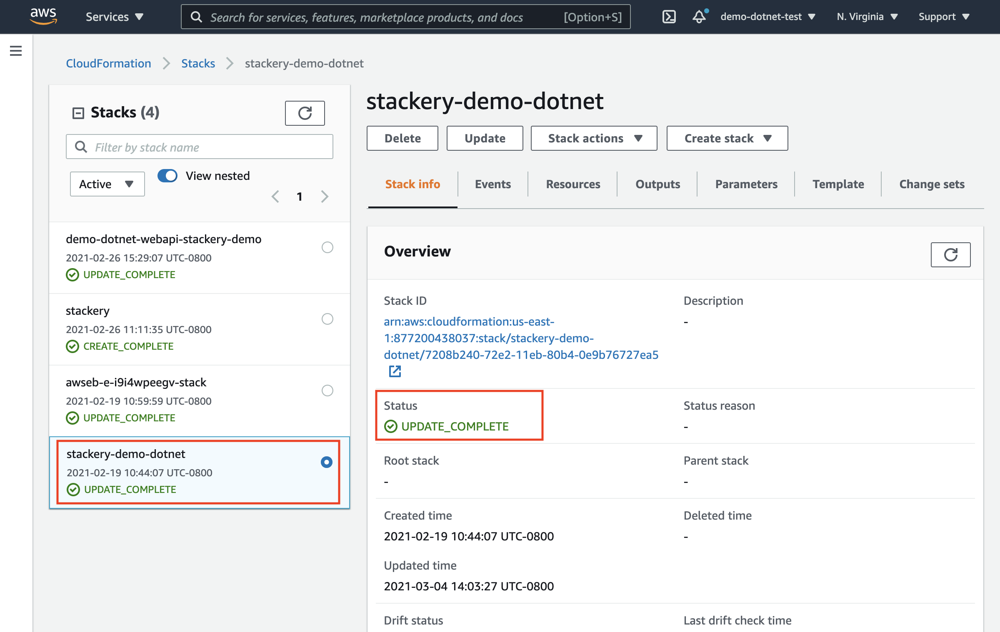

# Creating or Using an Existing AWS Account

## Required Permissions

To complete this workshop you will need permissions to create, manage, and delete the following resources:
* VPCs
* Secrets Manager Secrets
* Systems Manager Parameter Store Parameters
* RDS Database Instances
* Elastic Beanstalk Applications
* EC2 Instances
* Lambda Functions
* API Gateway HTTP APIs

If you do not have these permissions in an existing account (or if you prefer to complete the workshop in a new AWS account), continue to the [Create an Account](#create-an-account) section below. Otherwise, skip ahead to [Provision the Catalog API](#provision-the-catalog-api) section below.

## Create an Account
Click [here](https://portal.aws.amazon.com/billing/signup) and complete the sign-up process to create an AWS account. You'll provide your email address and create a password. You will need to enter a credit card to complete account setup. Your card will not be charged unless your account exceeds the free tier usage limits. All of the resources you will launch as part of this workshop are eligible for the AWS free tier if your account is less than 12 months old. See the [AWS Free Tier page](https://aws.amazon.com/free/) for more details.

## Provision the Catalog API

### Using the AWS Management Console
This is the simplest way to provision the Catalog API. If you're an advanced user and want to use the CLI, skip ahead to [Using the AWS CLI](#using-the-aws-cli).

Click [here](https://console.aws.amazon.com/cloudformation/home#/stacks/create/review?templateURL=https%3A%2F%2Fstackery-public-assets-us-west-2.s3-us-west-2.amazonaws.com%2Fdemo%2Fdotnet-framework-api%2Ftemplate.yaml&stackName=stackery-demo-dotnet) to provision the Catalog API in your AWS account using [AWS CloudFormation](https://aws.amazon.com/cloudformation/).

Note the region you are provisioning the API into and change it if it is not your preferred region. You will need to use the same region for all steps in the workshop.



Wait for the stack to complete provisioning.



Once the stack has created successfully you are ready to continue onto the [Workshop Setup](../3 - Workshop Setup/Workshop Setup.md).

### Using the AWS CLI
You can provision the Catalog API using the AWS CLI by running the following command. You will need to replace `<region>` with your preferred region. You will need to use the same region for all steps in the workshop.

```sh
aws cloudformation create-stack --region <region> --stack-name stackery-demo-dotnet --template-url https://stackery-public-assets-<region>.s3-<region>.amazonaws.com/regional/demo/dotnet-framework-api/template.yaml --capabilities CAPABILITY_IAM --on-failure DELETE
```

You will get a CloudFormation Stack ID back. Periodically, you can run the following command to see the last 5 events from the stack:

```sh
aws cloudformation describe-stack-events --region <region> --stack-name stacker-demo-dotnet --stack-name stackery-demo-dotnet --query 'StackEvents[0:5].{"1. Timestamp": Timestamp, "2. Resource": LogicalResourceId, "3. ResourceType": ResourceType, "4. Status": ResourceStatus, "5. Message": ResourceStatusReason}' --output yaml
```

Once the stack has created successfully you are ready to continue onto [Testing the Existing Catalog API](../2-testing/README.md).