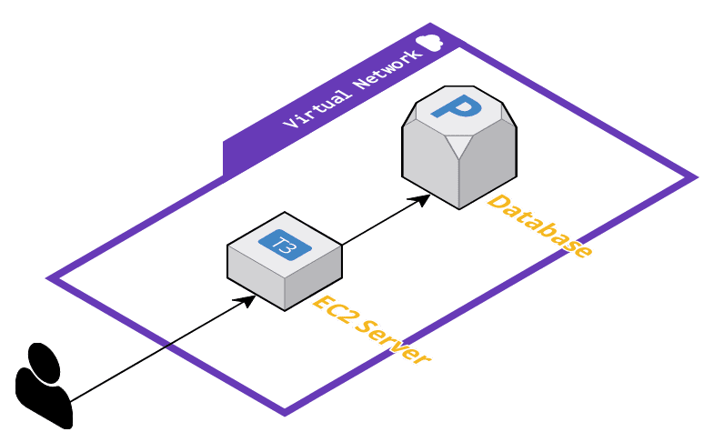
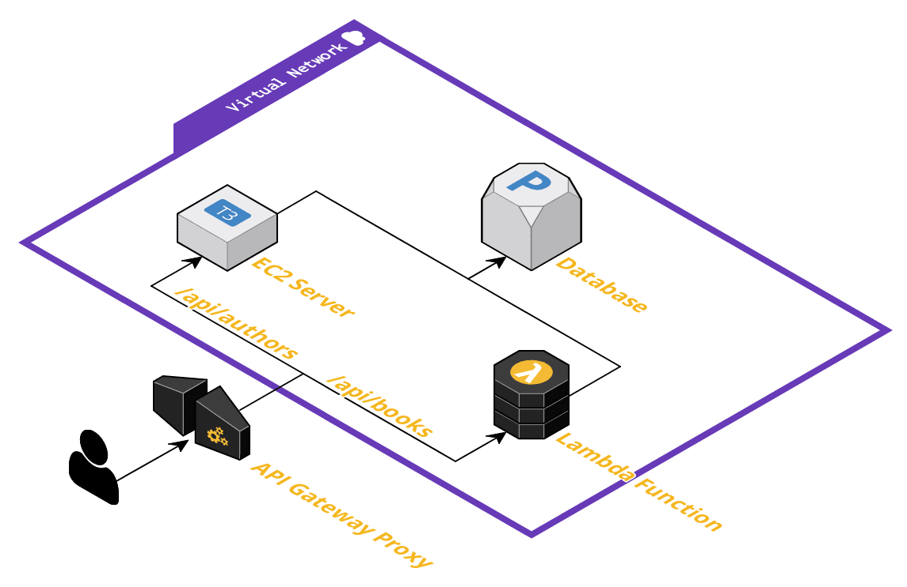
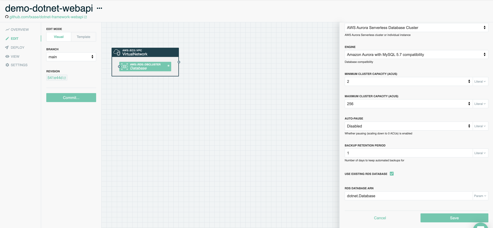
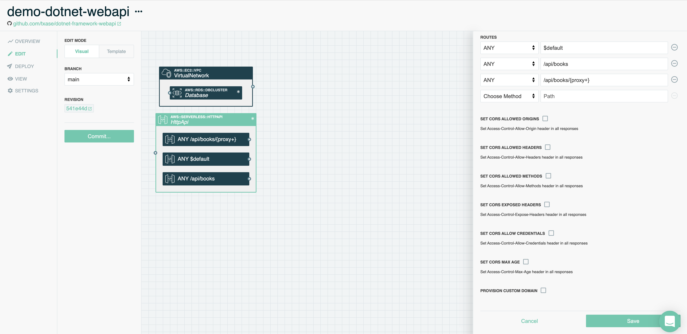
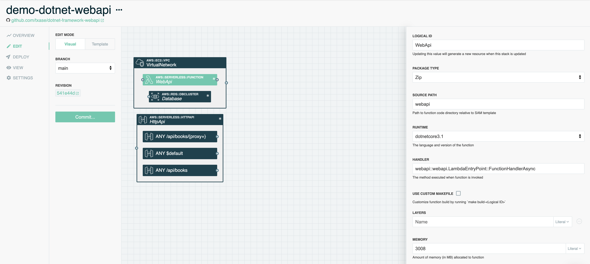
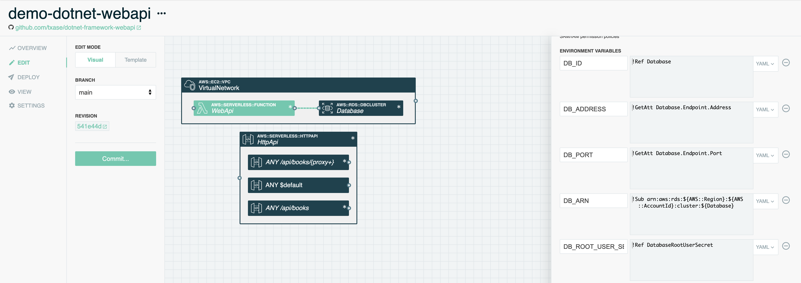
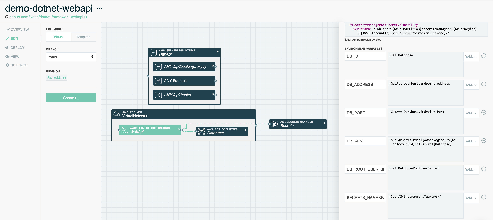

# Create the Infrastructure
After creating your new stack you'll be taken to the stack's **Edit** view, where you can visually edit the CloudFormation / SAM Infrastructure-as-Code template you'll use to modernize your application.

Our application architecture is two- or three-tier (depending on who you ask :wink:). There is a compute layer currently hosted on AWS [EC2](https://aws.amazon.com/ec2/) servers via AWS [Elastic Beanstalk](https://aws.amazon.com/elasticbeanstalk/) and a database layer hosted by Amazon [Relational Database Service](https://aws.amazon.com/rds/) (RDS) within an Amazon [Virtual Private Cloud](https://aws.amazon.com/vpc/) (VPC) to isolate the database from the public internet.

We're going to put an API proxy in front of the existing server, then re-route requests to the Books controller so they are handled by a new Lambda Function that will also run in the same virtual network to access records in the database.

## Add Existing Resources to Stack
Let's start by adding resources for your existing infrastructure to your stack. If you're not already at the visual editing canvas for your stack, go to the Stackery [Stacks](https://app.stackery.io/stacks) page, open your *demo-dotnet-webapi* stack, and navigate to the **Edit** page in the left sidebar.

### Virtual Network
First, open the resource palette by clicking the green **Add Resource** button in the top right corner of the canvas. Find the **[Virtual Network](https://docs.stackery.io/docs/api/nodes/VirtualNetwork)** resource and click or drag it into the canvas.

Double click on the new Virtual Network resource to edit its settings. At the bottom, check the box for **Use Existing VPC**. In the **VPC Data** field that appears, first click the drop-down on the right to switch from **Literal** to **Param**. Then type *dotnet.VirtualNetwork* into the field. This tells Stackery and AWS CloudFormation to skip provisioning a new VPC and instead re-use the VPC from the existing app that has been exported to the environment from the existing Catalog API stack. Scroll to the bottom and click the **Save** button.

### Database
Next, open the resource palette again and find the **[Database](https://docs.stackery.io/docs/api/nodes/Database)** resource. Click or drag it into the canvas, then drag it inside of the Virtual Network resource.

Similarly, double click on the new Database resource to edit its settings. Scroll to the bottom and check the box for **Use Existing RDS Database**. In the **RDS Database ARN** field that appears, first click the drop-down on the right to switch from **Literal** to **Param**. Then type *dotnet.Database* into the field. This tells Stackery and AWS CloudFormation to skip provisioning a new database and instead re-use the database from the existing app that has been exported to the environment from the existing Catalog API stack. Scroll to the bottom and click the **Save** button.

## Add New Resources to Stack
Now it's time to add the new API Gateway proxy API and Lambda Function to our stack.

### HTTP API
Next, open the resource palette again and find the **[HTTP API](https://docs.stackery.io/docs/api/nodes/HttpApi)** resource. Click or drag it into the canvas.

Double click on the new HTTP API resource to edit its settings. Update the Routes setting to have three routes:
* *ANY* method to the *$default* path. This *$default* route will handle any requests that don't match other routes.
* *ANY* method to path */api/books*.
* *ANY* method to path */api/books/{proxy+}*. This will capture all routes beyond */api/books/*, like */api/books/2* to return the second book in the catalog.

Scroll to the bottom and click the **Save** button.

Now double click on the new **ANY $default** route to open its settings. Check the box next to *Proxy to Existing HTTP Service*. In the **HTTP Service Location** field that appears, first click the drop-down on the right to switch from **Literal** to **Param**. Then type *dotnet.Application.EndpointURL* into the field. This tells Stackery and AWS CloudFormation to proxy requests to the default route to our existing Catalog API, which has been exported as a parameter to our environment. Scroll to the bottom and click the **Save** button.

### Lambda Function
Now it's time to add our new Lambda Function. Open the resource palette again and find the **[Function](https://docs.stackery.io/docs/api/nodes/Function)** resource. Click or drag it into the canvas, then drag it inside the Virtual Network resource. Putting it in the Virtual Network gives it local network access to the Database. The Function would be unable to connect to the Database without local network access because the Database is not publicly accessible.

> You can resize the Virtual Network resource by dragging its boundaries. This may make it easier to drag the Function resource into an empty space within the Virtual Network.

Double click on the new Function resource to edit its settings. Update the following settings:
* **Logical ID**: *WebApi*. This is the logical name of the resource in the SAM / CloudFormation template.
* **Source Path**: *webapi*. This is the location of our .NET source code in our repo.
* **Runtime**: *dotnetcore3.1*.
* **Handler**: *webapi::webapi.LambdaEntryPoint::FunctionHandlerAsync*. This is the class and method that AWS Lambda will invoke when an API request is received. It does not exist in our code yet, we'll add it soon.
* **Provision Concurrency**: *Enabled*. This will keep a number of Lambda Functions warm, decreasing the response time if a Lambda Function needs to be started from scratch. This is referred to as a *Cold Start*. You can read more about Cold Starts [here](https://mikhail.io/serverless/coldstarts/aws/).

> **Provisioned Concurrency** is the only cost incurred outside of the AWS free-tier when running this serverless stack. With these settings you will incur $32.40 per 30-day month keeping one Lambda Function instance provisioned. If you are using an AWS account from Event Engine this cost will not be charged to you. If you prefer not to incur this charge, you can leave **Provision Concurrency** disabled. You will observe Cold Starts that last a few seconds when making requests after a period of idleness.

Scroll to the bottom and click the **Save** button.

### Add Access to the Database
When the *WebApi* Function is invoked, it needs to access the Database. The Function needs two things to connect:
* The location of the Database.
* Authentication credentials.

To provide the location of the Database, click and drag a wire from the right side port of the *WebApi* Function to the left side port of the Database. This adds process environment variables like *DB_ADDRESS* to the *WebApi* Function our source code will use to locate the Database.

The credentials for the Database are stored in AWS Secrets Manager in our *stackery-demo* environment. To provide access to the credentials, first open the resource palette by clicking **Add Resource**, then click or drag a **Secrets** resource into the canvas. Next, click and drag a wire from the right side port of the *WebApi* Function to the left side port of the Secrets resource. This adds a permission policy, *AWSSecretsManagerGetSecretValuePolicy*, that provides access to secrets in the environment this application is deployed into. It also provides a *SECRETS_NAMESPACE* process environment variable to make it easy to access the right namespace for the environment in AWS Secrets Manager. We'll see how this is used when we update the source code for our application.

### Route Requests to the New Function
Click and drag a wire from the right side port of the *ANY /api/books* and *ANY /api/books/{proxy+}* *HTTP API* routes to the left side port of the *WebApi* Function. This creates an API integration to invoke the *WebApi* Function whenever API requests are received to these routes.

## Commit Changes
We're now done creating our new infrastructure! It's time to commit these changes to our Git repository. Click the green **Commit...** button. In the dialog that pops up you can review a diff of the template changes and customize the commit message. When ready, click the **Commit and Push** button.

It's time to start [modernizing the .NET application](../3-modernize-application/README.md) code to run in Lambda!