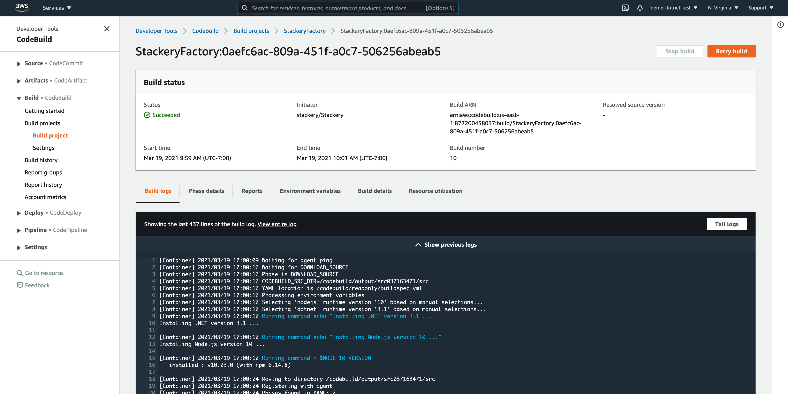
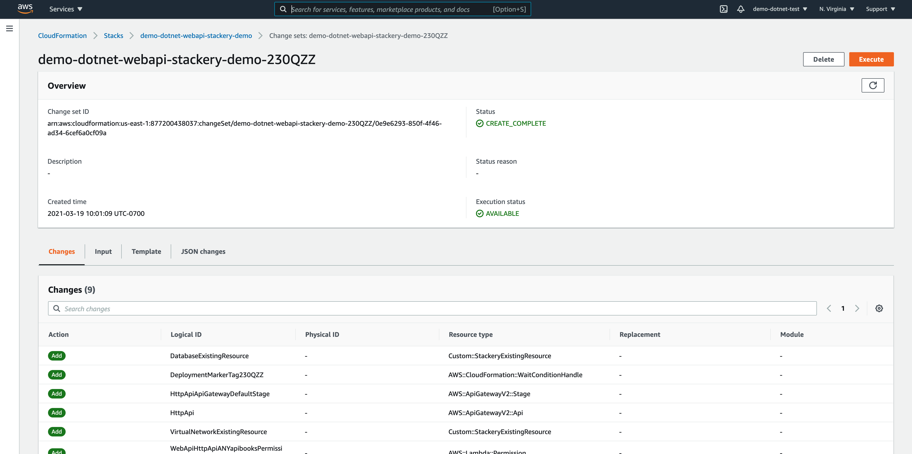
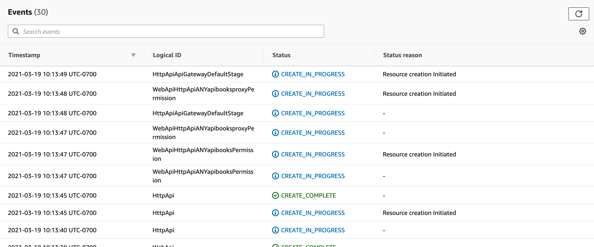

# Deploy and Test the Modernized API
We've done all the hard parts to modernize the API. Now it's time to deploy it out!

## Prepare a Deployment
> There are many ways to [deploy using Stackery](https://docs.stackery.io/docs/workflow/deploying-serverless-stacks). We're going to show how to do it using the Stackery and AWS dashboards, but if you prefer using a CLI you can install it based on instructions [here](https://docs.stackery.io/docs/using-stackery/cli) and use the [`stackery deploy`](https://docs.stackery.io/docs/api/cli/stackery_deploy) command to do it all in one step.

Click into the *demo-dotnet-webapi* stack in the Stackery dashboard at https://app.stackery.io/stacks. On the left-hand sidebar click to view the **Deploy** view for the stack.

Click the **Prepare new deployment** button for the *stackery-demo* environment. Use the default *main* branch or whichever Git branch you pushed your commits up to, then click the green **Prepare Deployment** button. This will launch an AWS [CodeBuild](https://aws.amazon.com/codebuild/) Project in your workshop AWS account and region to build the .NET Lambda Function and package and upload the CloudFormation template for review before deploying.

You can watch the build process by clicking the **Deploy Log** link. If the build fails you'll want to check these logs to see why.

## Deploy

Back in the Stackery dashboard click the green **Deploy** button once the preparation process completes successfully. This will take you to the AWS CloudFormation console to review the deployment.

Here you can review all the details of the deployment, including the resources being created from the fully packaged CloudFormation template. When you're ready, click the orange **Execute** button in the top right corner of the page. This will begin deploying your stack.

You will be redirected to the CloudForamtion's stack events page. It should take around 1-5 minutes for the stack to be created. While the resources are provisioning you can periodically click the refresh button in the top right corner of the **Events** section.

## Test
Once the stack has finished creating (you'll know when the stack is in the `CREATE_COMPLETE` state), go back to the Stackery dashboard. The stack is now deployed in the environment.

Click on the **View** link either in the left-hand sidebar or in the new deployment to take you to the architectural view of the resources.

Double click into the *HttpApi* resource to open its properties.

Click on the link next to the **Stage Location**. It will take you to the root page of the API which doesn't have a route defined. You'll see a 403 Forbidden error. But this gives us a starting point to test our API!

First, try adding `/api/authors` onto the end of the route. This will route through to our existing Catalog API and return results that look like the following screenshot:

Next, replace `/api/authors` at the end of the URL with `/api/books`. You should see results that look like the following screenshot:

You can see the existing Authors controller from the Catalog API returns results in XML format, which is the default format for the older ASP.NET Framework when making requests from browsers. The new Books controller from the modernized Catalog API returns results in JSON format, which is the default for newer ASP.NET Core APIs when making requests from browsers. This is a simple way for us to verify which version of the API we are interacting with.

> Both older ASP.NET Framework and newer .NET Core APIs can support XML and JSON, we're just using the default formats as an easy way to distinguish between the two for the purposes of this workshop. In a real-world scenario, you would likely want your modernized API to return results in the same format as the existing API. You can read more about supporting XML in .NET Core APIs when accessed through browsers [here](https://docs.microsoft.com/en-us/aspnet/core/web-api/advanced/formatting?view=aspnetcore-5.0#browsers-and-content-negotiation).

## Success!
You did it! You modernized an existing .NET Framework API to run serverlessly using AWS API Gateway and Lambda. More impressively, you did this without rewriting the entire app from scratch! Books R Us are super pleased.

At this point you can choose to complete the modernization by refactoring the Authors controller. Then you will be able to shut down the Elastic Beanstalk application and run completely serverlessly, in a more scalable, reliable, and cost effect manner. And you won't have to track any more operating system licenses for your servers :).

If you are running this workshop in your own AWS account, continue to the [Cleanup](../../5-cleanup/README.md) section to safely remove all the resources from your AWS account.